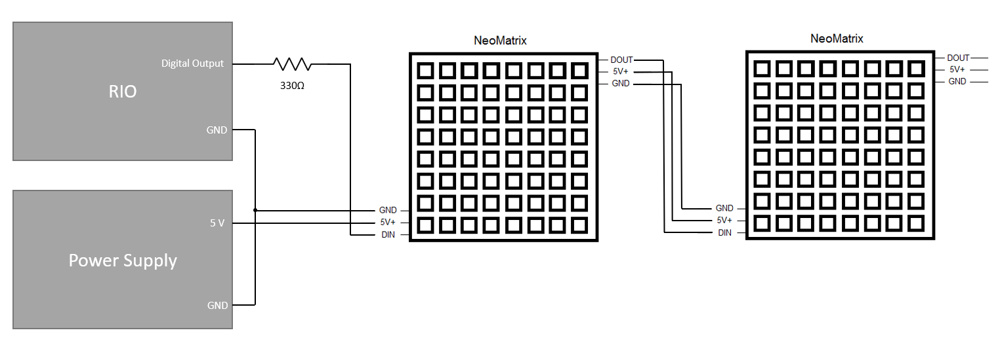
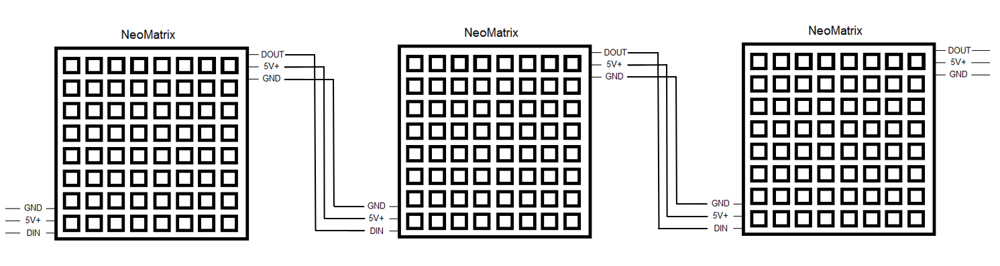
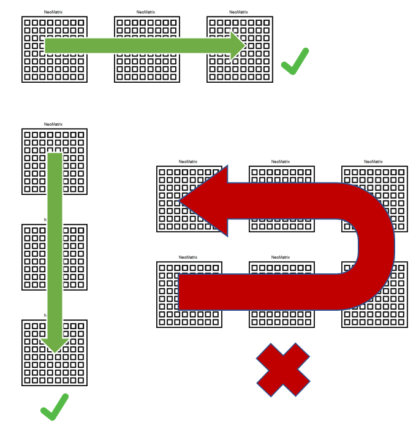

# myRIO-Neopixel

The myRIO-Neopixel is a LabVIEW RT and FPGA API that allow users to display multiple type of elements into a LED matrix made of neopixels (WS2812).

##LabVIEW Requirements

LabVIEW 2019 or older
LabVIEW RT
LabVIEW FPGA

##Hardware Requirements

NI RIO board with TTL outputs.
Neopixel Matrixes 8x8 Ws2812 5050

##Connections

The following diagram illustrates the diagram used for testing this library. Consider replicating the connection pattern if one or more 8x8 LED matrixes are required to be added.

This library has been tested using up to 3 Neopixel Matrixes 8x8 Ws2812 5050, but it should support more 8x8 matrixes. The current version of this library only supports the LED matrixes to be stacked in one dimension.

The limit of the number of matrixes that could be controlled by just one digital output will depend on how big is the FPGA that is been used, and also on the WS2812 limitations. Refer to [WS2812B Datasheet](https://cdn-shop.adafruit.com/datasheets/WS2812B.pdf) for WS2812 limitations.

##License
The myRIO-Neopixel is licensed under an MIT-style license (see LICENSE).
